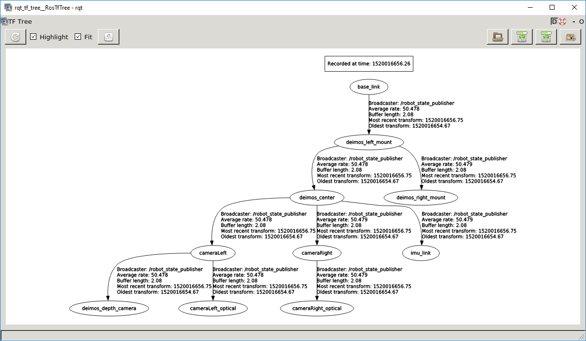

# Deimos

ROS package for i3D Robotics' Deimos stereo camera, derived from the e-consystems See3CAM_Stereo (Tara) camera driver. This driver is in turn based on the [uvc_camera](https://github.com/ktossell/camera_umd/tree/master/uvc_camera) package. We have made significant improvements to the driver which make it a lot more usable in ROS.

## Status


## Installation

For an easy setup, a rosinstall file is provided in 'install' folder of this repo which can be used to get this package and it's dependent ros packages in your workspace. 
In your ROS workspace use the following command:
```
wstool init src https://raw.githubusercontent.com/i3drobotics/i3dr_deimos-ros/master/install/i3dr_deimos_https.rosinstall
```

If you do not use wstool, you can download the packages using the following command:
```
cd PATH_TO_ROS_WS/src
git clone https://github.com/i3drobotics/i3dr_deimos-ros.git
git clone https://github.com/i3drobotics/i3dr_stereo_camera-ros.git
```

To install package dependences use rodep:
```
rosdep install --from-paths src --ignore-src -r -y
```

Build using catkin (tested with catkin_make and catkin_build):
```
catkin_make
or
catkin build
```

Plug in your Deimos camera to your machine and use the following launch file to test:
```
roslaunch i3dr_deimos deimos.launch
```

To check everything is working add the paramter 'rviz':
```
roslaunch i3dr_deimos deimos.launch rviz:=true
```

This package has been tested informally on Ubuntu 16.04, but should run on most distros. It has also been tested on the Jetson TX1 and TX2.

## Sample Bag
The camera system can be tested when the camera is not connected by using one of our sample bags. These can be downloaded using the 'download.sh' script in the 'bag' folder:
```
./download.sh
```
Scene001: Random objects (wooden blocks, book and hard drive) on textured floor (duration: 11 seconds)

Once downloaded you can use the standard launch file to play the bag file using:
```
roslaunch i3dr_deimos deimos.launch device:=rosbag
```

This will loop and publish the following topics:
- tf
- i3dr_deimos/left/camera_info
- i3dr_deimos/left/image_raw
- i3dr_deimos/right/camera_info
- i3dr_deimos/right/image_raw

## Introduction

Creates a stereo image node pair (`left/image_raw` and `right/image_raw`) from any connected Deimos device. This is for compatibility with any other ROS modules which support stereo cameras. This driver has been modified to respect ROS image pipeline conventions and to ease use of the IMU. As per convention, both left and right images are published in the left camera optical frame. IMU data are published in the `imu_link` frame on the `imu_data` topic.

The following nodes will be created upon launching this driver.

``` bash
    /i3dr_deimos/concat
    /i3dr_deimos/image_raw
    /i3dr_deimos/left/image_raw
    /i3dr_deimos/left/camera_info
    /i3dr_deimos/right/image_raw
    /i3dr_deimos/right/camera_info
    /i3dr_deimos/get_brightness
    /i3dr_deimos/set_brightness
    /i3dr_deimos/get_exposure
    /i3dr_deimos/set_exposure
    /i3dr_deimos/imu_data
```

The Camera preview can be seen using any basic ROS camera application. `rqt_image_view` can be used for simplicity.
To Install and use `rqt_image_view` 

```bash
sudo apt-get install ros-jade-rqt-image-view
rqt_image_view
```

## Frames

This package has been updated to conform to the ROS image pipeline frame conventions.

Image conventions in ROS can be a bit confusing, as computer vision usually defines the Z axis to point out of the image, wheras in ROS Z is normally upwards. For this reason cameras define a separate `optical` frame which is rotated. Note that also both images are published in the left optical frame. This is because typically when using a stereo camera, the right image is effectively ignored. The point cloud is derived and intensity mapped using data from the left camera.

You can see in the URDF file for Deimos - there are two links for each camera. The `cameraLeft` and `cameraRight` links are the nominal locations of the image sensors, but the `_optical` links are rotated in X and Z. This means that when you view the point cloud in RVIZ it should appear the right way up.

## TF tree

The full tree for a Deimos system is shown below:



## Calibration

You can calibrate the camera using ROS' camera calibration tool. Run the basic launch file with the 'calibrate' parameter:

```bash
roslaunch i3dr_deimos deimos.launch calibrate:=true
```

This will assume you are using an 8x6 calibration board with 0.039m squares. If you have a different board you can specify the settings with the parameters 'grid_rows', 'grid_cols','grid_size':
```bash
roslaunch i3dr_deimos deimos.launch calibrate:=true grid_rows:=8 grid_cols:=6 grid_size:=0.039
```

The calibration display should appear. 

See [link](http://wiki.ros.org/camera_calibration) for details.

## Some Tested Examples

* To check the exposure of the camera at run time:

```bash
rostopic echo /i3dr_deimos/get_exposure
```

* To check the brightness of the camera at run time:

```bash
rostopic echo /i3dr_deimos/get_brightness
```

* To change the exposure of the camera at run time:

```bash
rostopic pub -1 /i3dr_deimos/set_exposure std_msgs/Float64 "data: <value>"
```

e.g. :

```bash
rostopic pub -1 /i3dr_deimos/set_exposure std_msgs/Float64 "data: 20000"
```

* To change the brightness of the camera at run time:

```bash
rostopic pub -1 /i3dr_deimos/set_brightness std_msgs/Float64 "data: <value>"
```

e.g. :

```bash
rostopic pub -1 /i3dr_deimos/set_brightness std_msgs/Float64 "data: 6"
```

* To read the inclination of the camera using the built-in IMU:

```bash
rostopic echo /i3dr_deimos/get_inclination
```

* To read the angular velocity and linear acceleration of the camera using built-in IMU:

```bash
rostopic echo /i3dr_deimos/get_IMU
```
